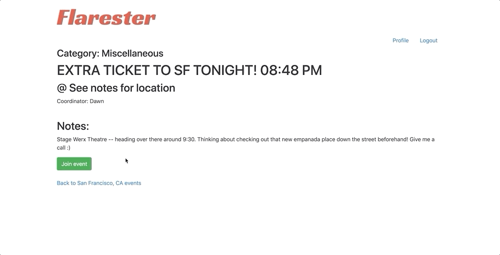
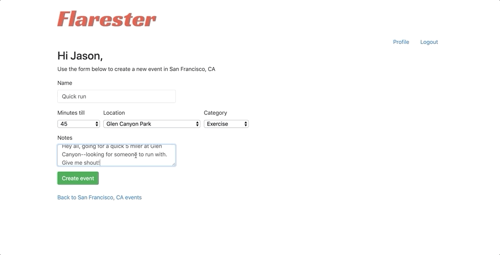
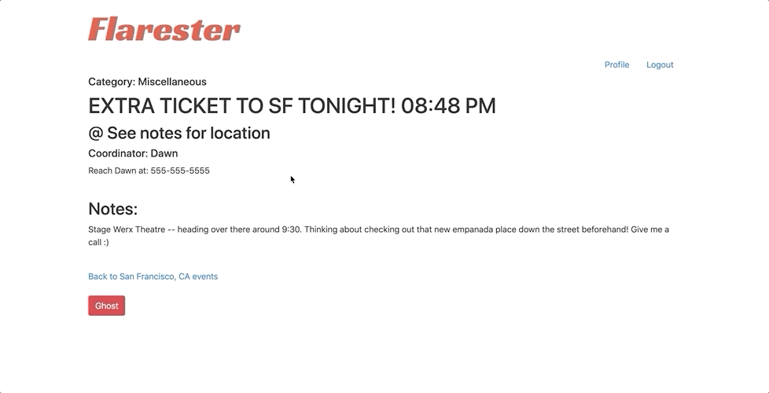

# READ ME

Flarester allows users to create and/or join events in their area similar to Meetup. But Flarester differentiates itself by aiming to provide these services only for events occuring within two hours of being listed. Once created, listings populate to the local event list and are automatically removed once their scheduled time has expired.  

**Check it out at the link below:**

https://powerful-eyrie-94140.herokuapp.com/

-----------------------------------------------------------------------------------------------------------------------------------

                                                 Create an account
                                                  

-----------------------------------------------------------------------------------------------------------------------------------

                                      Log in to view current events in your area
                                                       

-----------------------------------------------------------------------------------------------------------------------------------

                                                   Join an event
                                                   
  

-----------------------------------------------------------------------------------------------------------------------------------

                                              Create and list an event
                                              

-----------------------------------------------------------------------------------------------------------------------------------

-----------------------------------------------------------------------------------------------------------------------------------

                                                Back out of an event
                                                

-----------------------------------------------------------------------------------------------------------------------------------

                                             View and edit your profile
                                             

-----------------------------------------------------------------------------------------------------------------------------------

**Ruby version 2.6.1**

**Once you've cloned the repo, make sure to run the following commands from the app's directory:**
- `bundle install`
- `rails db:create`
- `rails db:migrate`
- `rails db:seed`
   - You can add additional city and location objects in app/db/seed.rb--if you do, make sure to run 
    `rails db:seed` again. 
    
**Run the app**
-Just type `rails s` into your command line (from the app's directory, of course) and hit return. You should be up and running!

- The app does have a test suite--if you plan on running it, you'll need to install Rspec with `rails g rspec:install` 
Once installed, simply type `rspec` into the command line and hit return--this should run the suite.
